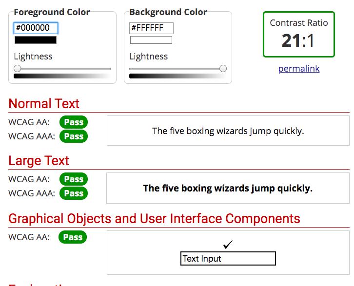

# DH 150 Assignment 07 - High-Fidelity Prototype by Christine Yu
## UCLA Economics Website Prototype

# Prototype Links

- Interactive Prototype (Version 1): https://www.figma.com/proto/12uOULPQAPqHf83Bf2iLLo/High-Fidelity-Prototype?node-id=1%3A5838&scaling=scale-down

- Wireframe URL (Version 1): https://www.figma.com/file/12uOULPQAPqHf83Bf2iLLo/High-Fidelity-Prototype?node-id=1%3A5814

# Brief Summary: Purpose and Process
- This is a high-fidelity test for the UCLA Economics Website. I created this prototype by using Figma. The purpose of this test is to evaluate the effectiveness and usability of performing three tasks. These three tasks were inspired by three personas from a prior assignment: Justin, Betty, and Peter. The key tasks are improved search results, ability to add workshop event to a calendar, and access to an international resource section. 

- The process began by consulting my low fidelity prototype on paper and translating those components to graphic components in Figma. I utilized color contrast between the colors found on the UCLA website to highlight typography in the foreground. I consulted the original UCLA Economics website to figure out the positioning of images and graphic elements such as the search bar. I first developed the home page and used that as the main base for the wireframes by maintaining consistency on the layout of the top banner and footer.  By moving through each task, I created wireframes that logically followed the flow of the task. To complete the prototype, I would check each wireframe and ensure that the buttons are properly connected to the next wireframe. 

# Tasks supported by the Interactive Prototype
- A HOME Button on each UCLA Economics page at the top left corner (that returns to the home page)
- Search by using the search bar that provides detailed search results
- Search suggestions are offered by the search bar
- Can navigate to the International Student Resources page 
- Calendar Date Selection for Workshops
- Edit personal information before confirmation
- Link workshop registration to a calendar of choice
- Sign up for workshops

# Prototype Designs

## Screen Designs (Version 1)

## Wireflow with the Screen Designs (Version 1)
 

# Color Scheme and Accessibility

- I chose the color scheme based on the original colors of the UCLA Economics website. The UCLA Economics website utilizes blue, white, and black primarily. I started off utlizing the theme colors within Figma. One of the theme colors was called Blue 1 (#2F80ED) and I originally assumed that there would be no issues with contrast because it appeared similar to the color utilized on the website. When testing the accessibility of colors, I discovered that it failed to qualify for 4.5:1 ratio with the white background (#FFFFFF). I decided to change the saturation to a darker shade of blue (#1D6FDE). This shade of blue fulfilled the WCAG 2.0 AA level. 

- I also checked the contrast between black (#000000) and white (#FFFFFF). It passed all color contrast testing. 

- I wanted to check the level of contrast between the color of the search bar and the background shade of blue (#1D6FDE); however, Figma did not show me the color in hexadecimal format. The search bar color utilized a surface overlay which meant it was a darkened shade of the background color of 12%. Because of this, I am unsure if the level of contrast is satisfactory for the search bar. 

- The colors of the buttons on the prototype are consistent with blue (#1D6FDE) and white (#FFFFFF) for contrast. This also provides visual consistency on the wireframes. 

# Typography

- I used Roboto in size 14 for the body texts on the pages. For page titles, I used Roboto of size 24. This consistency made it easier to read and readers could distinguish between text by size. Roboto has simple lettering that would help the reader process text easily. Roboto was similar in font to the original font of the UCLA Economics website. 

# Impression Test and Cognitive Walkthrough

https://docs.google.com/document/d/1WZQ3Wpv1MQy2v7nslzcC8CXBeUd0vwptEGRSaAEEtiA/edit?usp=sharing

The impression test and cognitive walkthrough revealed several issues that I wanted to revise within the prototype. 

**Impression Test**

The overall impression was that the prototype reflected the UCLA Economics department and that the primary audience for the website was the faculty, undergraduate population, and graduate level population. Users got the impression that you could sign up for workshops with the calendar and perform searches. However, some users were unable to determine that the calendar was clickable. The users wanted back buttons for the search screens. 

**Cognitive Walkthrough** 

Overall, users found that the buttons were understandable and had consistency with the blue coloring. Some users thought that the calendar was unclear and the font was very small so they provided recommendations, such as vertical stacking of information. Users thought interaction points were clear between one screen and the next. 
The other recommendations for improvement are listed below:

- Users expected a back button for the search pages rather than using the home button to go back.
- Since it was a mobile setting, users recommended stacking the information vertically rather than horizontally on the mobile website so the font would be larger. 
- Users recommended having a progress bar for the sign up pages so that they would know progress is being made. 
- Users found it strange that there is a list of numbered search results and wanted it to be unnumbered. 
- Some users found the picture of Royce to be unnecessarily large and could be used as a backdrop instead. 

# Prototype Version 2

After revising the prototype, I created a version 2. 

- Interactive Prototype (Version 2): https://www.figma.com/proto/gBYc7GWlX1WLXAPrrcAg3n/High-Fidelity-Prototype-Version-2?node-id=1%3A5838&scaling=scale-down

- Wireframe URL (Version 2):https://www.figma.com/file/gBYc7GWlX1WLXAPrrcAg3n/High-Fidelity-Prototype-Version-2?node-id=1%3A5814

This version 2 reflects revisions that were recommended by users and present much more clearly in a mobile format compared to version 1. 

# Reflection and Revisions

Overall, I successfully prototyped the three tasks of providing improved search results, demonstrating access to an international resource section, and adding workshops to a personal calendar. While I initially used the UCLA Economics website as the starting point for the formatting of the screens, user feedback helped me realize this formatting was not optimized in the mobile format. It was true that the font was small and made it difficult to determine interaction points if I followed the side by side arrangement of the original website. By realizing that I did not have to follow the exact guidelines of the original, I could revise the prototype to promote usability and clarity. 

Some of my personal thoughts for prototyping such as numbering the search results did not seem helpful for users. I realized that it is difficult to separate my personal preferences and that I should be more conscious of my own biases toward the prototype. Just because I think it is a good idea does not mean that other users would need or want that result. 

**Revisions**
The revisions I made are adding back and forward buttons on the search results so that users can easily go backward and forward. I removed the numbering from the search results.

I stacked the information vertically on the home page screens and I also made a drop shadow effect on the calendar to make it clear that it was clickable. I increased the font size for the calendar on the home page. 

I added a progress slider at the bottom of the workshop sign up pages indicating 25,50,75, and 100 percent progress being made. 

I made Royce Hall into the size of a banner instead of the original large size and it reduced the focus on the image. This insight was helpful because I did not realize it deterred users' navigation through the page. 

