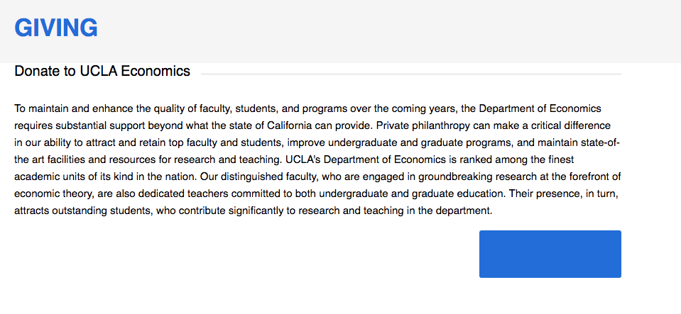
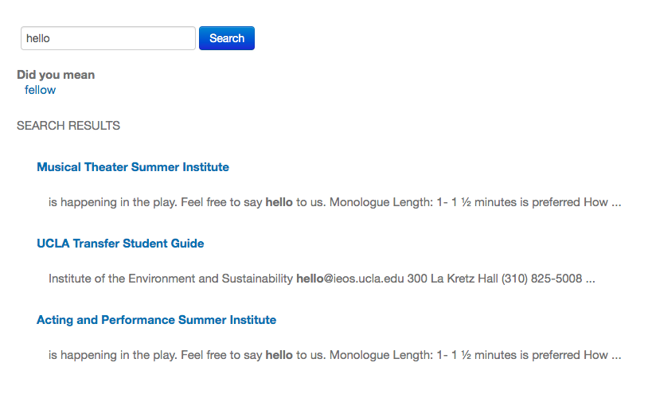

# UX Design to Improve Usability 
## DH150 Assignment 01: Heuristics Analysis by Christine Yu

Motivation 

I chose to focus on analyzing websites that are frequently used by economics majors of University of California, Los Angeles, in particular the UCLA official website for economics and the UCLA Summer sessions website. As a frequent user of both these websites, I noticed flaws that can deter users from having an easy to navigate experience. An unpleasant experience can provide difficulties for future economics students and introduce frustrations. Therefore, I aim to label and analyze these flaws using the Jakob Nielsen's 10 Usability Heuristics for User Interface Design. I hope by doing so I am able to propose potential ways to improve the user experience and interaction with these two websites. 

## Heuristic Severity Evaluation Scale

1- A cosmetic problem, only fixed if time allows

2- A minor usability problem with low fix priority

3- A major usability problem that is important to fix and high priority

4- A usability catastrophe that must be fixed 

## First Website- UCLA Economics Website
https://economics.ucla.edu/

Information about the Website:
  
  The UCLA Economics website serves as the primary source of knowledge about classes, research, and workshops for economics majors at all levels starting from the undergraduate to the Ph.D. The website explains that the Economics Department at UCLA has two particular objectives- conduct cutting edge research and train the next generation of economic leaders. In this website, it lists its central navigation under 7 menus- "About", "Faculty", "Undergraduate", "Master", "Ph.D", "Alumni", and "Calendar". Users utilize this website to receive updated information from the economics department regarding new opportunities or classes, read research publications, and connect with various resources to further develop career opportunities. The website is managed by the UCLA Department of Economics. 
  

Initial Evaluation and Motivation:

- My first impression of the website is it can be quite cluttered graphically because there are large sections of information to process on the homepage. Navigation to the required information can be difficult if you are using the navigation menu offered because there are a large number of hypertext links to pages. There is a search bar; however, the search bar is particularly small, which can cause readers with sight issues to have trouble finding the information. The lettering for the menu navigation in the sidebar are all listed in capital letters and blue text, making it difficult to read and pinpoint clear distinctions between website pages. It creates a mildly unpleasant experience for the users. It appears that the website was designed without consideration of user experience and simplicity. 

- I chose the UCLA Economics website because I am a frequent user of its many functions and there have been multiple times I have been inconvenienced by its navigation system. I find that other users might be finding issues with its usability as well and would like to dive deeper into labeling its flaws to propose potential solutions. I also find that there are elements the website does well in terms of its textual explanations. 

## 1) Visibility of System Status

- The website does not always make it clear which page of the website we are on. For example, when you click into a webpage, the menu sidebar does not change so it is unclear which page of navigation we are currently on. Typically, it would be expected that the web page navigation link would be bolded, capitalized, or a different color to ensure the user knows which section they are at. The title of the webpage is listed in large typography, which can offset this issue; however, the user will still struggle to know the system status from the sidebar alone. By lacking this progress indicator, the user may click the links on the menu sidebar multiple times because it is unclear if the first navigation attempt worked. I would propose changing the menu sidebar link so that it is a different color such as black to make the navigation clear. Severity Rating (2)

- When the user is navigated to the giving page, it is unclear what the blue button on the screen is meant to do. A user may not know to click on the blue button to navigate to the donation page. When a user does click on the button, it changes to black and yellow and indicates the word "donate" only for a few seconds. I propose labeling clearly that the button is meant to redirect a user to the donation page by labeling "donate" on the button prior to clicking. Severity Rating (2)

## 2) Match between System and the Real World

- On the home page, it does not provide a clear introduction to the website so it makes first time users uncertain as to where to navigate to find information that they require. The home page appears to primarily be made of news from faculty, research spotlights, and events. Usually when users face a website for the first time, they will read an introduction on the home page so that it is clear what the organization provides and where they should go to find more information. The UCLA Economics home page fails to address those questions and leaves novice users lost when they try to navigate the website. The user may even assume that they were directed to the faculty page rather than the overall economics department website. The page does not follow real world conventions. I propose listing a brief introduction on the home page and making the search bar larger for users. Severity Rating (3)

- I find that the website does do well in utilizing familiar language. For example, under the "Why Study Economics?" page, the website utilizes familiar words and explains the definition of incentives in an easy to understand way by explaining how it studies the way people make choices. By following real world conventions in this way, the website makes it easier for the user and more enjoyable. 

## 3) User control and Freedom

- When going through the "Contact Us" page, the user may accidentally click on one of the email addresses. On the MacOS system, this prompts the system to immediately open the "email" appplication. There is no undo function once this occurs so it creates trouble for the user to undo this command manually. I would propose having the option to cancel before the email application is launched. Severity Rating (2)

- When clicking on the "Master" menu link on the top of the page, it redirects the user to a new website that is separate from the primary Economics page. In order to undo this action, the user will have to manually go back through their browser or retype the website because there is no action that appears to indicate that the user is being redirected to a new page. I propose providing a pop-up box to make it obvious that the master's page is a new website and asking the user if they would like to navigate to a new website. Severity Rating (2)

## 4) Consistency and Standards

- Typically a website would list the contact page, about page, and privacy policy in the footer bar of each page as part of platform conventions. The UCLA Economics page lists the "Contact Us" page in the footer bar; however it lacks the other two pages. It also includes other links that directs users to campus resources, which are helpful but unnecessary. I would propose adding links to the about page and privacy policy as well as reducing the irrelevant and unnecessary links in the footer bar. Severity Rating (2)

- Overall, the website does follow conventions such as having the search bar on the right hand side and the main logo on the left hand side. The arrow navigation through the home page images are also consistent with website conventions.

## 5) Error Prevention

- In the search bar, if I make a typo in the search, there is no suggestion in the search bar to change it to a different word. It does not help to detect errors in the search. This can result in improper results. I propose including search suggestions for errors and a detection system for typo errors. Severity Rating (2)

## 6) Recognition rather than recall

- The search bar does include a search history; however it includes search terms from searches outside of the current website which may confuse the user. While this does allow the user to recall and resume previous search activities, it would be preferable to have the search history only include terms searched within the Economics website. I would propose restricting search history to recent searches within the Economics website. Severity Rating (1)

## 7) Flexibility and efficiency of use

- The search button is small and does not allow a user to filter its searches to a more specific page or section of the website. I would propose creating a more detailed filter system so that search results do not end up with an extremely large amount of information to filter through. I suggest making the search button larger. Severity Rating (3)

- The website does have a "back to the top" option to make scrolling up a more efficient task. This will help a more experienced user. 

## 8 ) Aesthetic and Minimalist Design

- The website contains a large amount of text, making the design seem more complicated and overwhelming to users. In addition there are numerous navigation links and sublinks under the dropdown menus, which could be simplified through combination or elimination of pages. I would suggest eliminating unnecessary graphics, reducing the number of possible navigation options, combining pages of similar information if possible, and reducing irrelevant text. I would propose minimizing overuse of space.  Severity Rating (3)

## 9) Help users recognize, diagnose, and recover from errors

- If the user makes a typo in the search result, there is no indication of an error. There is also no option to recover from a typing error. While the user is able to manually fix their errors, I would suggest a system to diagnose search errors by showing suggestions in the search bar and providing other common search options. Severity Rating (2)

- If a user mistakenly navigates to the Admin Login, it is unclear to the user that they have navigated to the wrong page. It provides options for logging in with a username and password. While there is a back button to UCLA Economics at the bottom, the user may not realize they are at the wrong page. I propose removing the Admin Login link in the footer bar because users should not be able to access the internal private settings of the website. Severity Rating (3)

## 10) Help and Documentation

- While there is a FAQ section, a novice user will likely experience difficult navigating to the FAQ page because there is a large amount of dropdown menu options to look through. I would propose making the FAQ section a permanent fixture as a menu option in the top bar. Severity Rating (2)

- There is no feedback option within the pages to reports errors in the website. I propose providing a simple feedback form link in the footer bar so users can write their comments and issues. Severity Rating (2)

## Second Website- UCLA Summer Sessions
https://summer.ucla.edu/

Information about the Website:

The UCLA Summer sessions website serves as the main portal for all students seeking to take a summer course at UCLA. Its users includes US high school students, international high school students, and continuing undergraduate students. The website provides information on fees, processing procedures, and content related to summer academic coursework. The Summer Sessions website contains 4 main dropdown menus- "I am a/an...", "Programs", "Fees", and "Register". This website is managed by UCLA Summer sessions department. 

Initial Evaluation and Motivation: 

- The website appears to be easy to navigate. They have a relatively minimalist design with only 4 dropdown menus. The homepage also has a simple design with 6 navigation links. There is a footer bar with "Contact Us", "FAQ", and various social media links which follows standard conventions. The website appears to be well organized and not overly confusing or complicated. Within some of the pages, there is an inconsistent sense of formatting and spacing, in which some pages choose a 2 column approach to format their information. Overall, it seems there is some consideration for user experience within the website. 

- I chose the UCLA Summer Sessions website because I remember being minorly inconvenienced as an incoming freshman to navigate the registration process and wanted to explore aspects of user experience through this platform. I find that UCLA Summer Sessions have become an increasingly important part of a UCLA student's experience because the majority of students have at least had to take summer courses once in their 4 years at UCLA in order to access courses they were unable to during the lottery system. By improving user experience to the UCLA Summer Sessions website, current and future UCLA students are able to have an easier time with the website. 

## 1) Visibility of System Status

- When viewing the dropdown menu, the user is able to hover over the page navigation link and it indicates that the user is about to click into the correct page by showing a lighter colored text. This change in color makes it clear to the user which part of the website they are navigating to. In the image below, you can see that "Incoming UCLA Student" is a lighter color than the surrounding text. It can be somewhat hard to discern this small difference in the background. I would recommend making the color difference clearer by making it even lighter or bolding the words to make it more pronounced. Severity Rating (1) 

- The pages of Incoming and Continuing UCLA Student under the dropdown menu for "I am a/an..." both start with the same initial appearance. They include the same video and relatively similar layout which makes it difficult for a new user to discern whether they have navigated to the correct page. I recommend labeling a clear bold title at the top of the page to make sure the user is certain they have navigated to the correct page. Severity Rating (2)

## 2) Match between System and the Real World

-   In the website, the links are frequently denoted with acronyms such as SIS and SCIP, which can be confusing to new users. New users will not likely be familiar with these acronyms without context. I suggest providing a brief introduction on the home page to provide context for these acronyms so that users will know what differentiates each program. Severity Rating (2)

## 3) User control and Freedom

-The user is able to navigate out of the registration page for UCLA Summer Institutes by using a "No, I do not wish to continue" button. This is labeled at the bottom of the page. This does provide users the ability to navigate out of the wrong page; however, by labeling this button at the bottom of the page, this makes the user go through an extended text dialogue. I propose placing this button at the beginning of the page, ensuring that there is an emergency exit in the case of mistaken navigation. Severity Rating (1)

- Other navigation pages for registration lack exit buttons. This can provide trouble for novice users when trying to move from one page to another. I propose introducing exit buttons at the top of these navigation pages to exit out. Severity Rating (2)

## 4) Consistency and Standards

- When navigating the dropdown menu, the difference between the label of a U.S. Student and U.S. High School student is not immediately clear to the user. Users may perceive that clicking on either link would yield the same result when in fact they are separate definitions. I recommend labeling U.S. Student as U.S. College student or U.S. Non-High School student to differentiate the terms. Severity Rating (2)

- Overall, the UCLA Summer Sessions website does a good job of following standard conventions. The footer bar contains "Contact Us", "FAQ", and social media links in the conventional locations. The search bar is located on the right side and the main logo is located on the left. 

## 5) Error Prevention

- When the user fails to type in the search bar, this error message appears to let the user know that they failed to enter any keywords. This demonstrates that the website paid attention to providing error prevention methods to their users. 

- The search bar also provides alternative suggestions for a search result. This can also prevent errors when a user types wrong. 

## 6) Recognition rather than recall
- The search bar of the UCLA Summer Sessions website provides a recent search history list, reducing the need for the user to recall their previous searches. This makes it easier for a user to resume old searches. This promotes recognition rather than recall. 

## 7) Flexibility and efficiency of use
- The UCLA Summer sessions website provide multiple ways to access the same information. One way is to utilize the navigation menu on the top bar. Another way is to utilize this getting started dropdown menu. Both provides flexibility for the user in the case that a user may miss the menu bar at the top. 

## 8 ) Aesthetic and Minimalist Design
- 
## 9) Help users recognize, diagnose, and recover from errors
- 
## 10) Help and Documentation
- 
